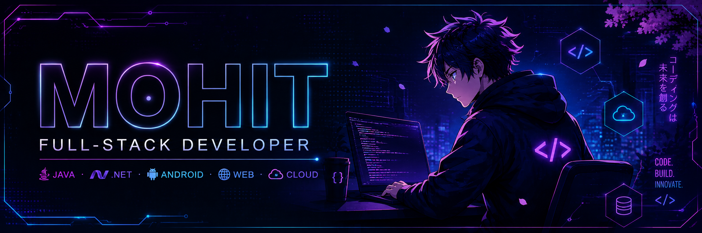

  

<h1 align="center">
  Hi, I am <i></i> Mohit Tanwar 
</h1> 

🎓 I'm a **BCA (Bachelor of Computer Applications) student** passionate about technology, programming, and building innovative projects.  

---

## 🧑‍💻 About Me

I'm a passionate developer currently focused on academic and personal projects that sharpen my skills across **Java, .NET Framework, Android Development, and Web Technologies**. I enjoy diving deep into **Software Development, Database Management, and Cloud Computing** — always curious, always building.

I'm actively looking to collaborate on beginner-friendly open-source projects and connect with like-minded coding communities. Whether it's **Java, C, C++, .NET, Android, or Web Development basics** — feel free to ask me anything!

Outside of code, I love solving logical problems and exploring new tools that make development smoother and smarter. ⚡

📫 Reach me at: 

---

## 🛠️ Languages & Tools

### 💻 Programming

### 🌐 Web Development

### ⚙️ Frameworks & Platforms

### 🗄️ Databases

### 🧰 Tools & Editors

---

### 📌 Interests & Focus Areas

-  **Software Development:** Building robust backend logic and scalable applications.
-  **UI/UX Design:** Crafting clean, accessible, and highly intuitive user interfaces.
-  **Open Source Projects:** Collaborating with global communities and contributing to impactful projects.
-  **Problem Solving:** Cracking complex algorithmic puzzles and optimizing code performance.

---

## 🌐 Connect With Me

---

⭐️ *Always eager to learn and contribute to real-world projects while enhancing my skills as a developer.*  

---

